# E-Commerce Order Management System

👤 **Student Info**  
- Name: Shema Owen  
- Student ID: 26253  
- Course: Database Development with PL/SQL (INSY 8311)  
- Instructor: Eric Maniraguha  
- Academic Year: 2024–2025  

---

## Table of Contents

- [Problem Statement](#problem-statement)  
- [Objectives](#objectives)  
- [Technologies Used](#technologies-used)  
- [Project Phases](#project-phases)  
- [Major SQL Files](#major-sql-files)    
- [Conclusion](#conclusion)  

---

## Problem Statement

Many e-commerce platforms face challenges with manual order processing, lack of automation, limited traceability, and weak enforcement of business rules. This project builds a robust, PL/SQL-based system that ensures secure, efficient, and auditable order management.

---

## Objectives

- Automate order processing using PL/SQL procedures and functions  
- Enforce business rules with triggers and packages  
- Restrict sensitive operations during holidays and specific timeframes  
- Implement auditing to log user actions for accountability and data integrity  

---

## Technologies Used

- Oracle PL/SQL  
- SQL Developer  
- GitHub for version control and documentation  

---

## Project Phases

### Phase I: Initial Setup  
- Created core tables and inserted sample data  
- Added initial SQL scripts and documentation files  

### Phase II: Business Process Modeling  
- Documented order management business processes  
- 📄 [Business Process Modeling Document](./Phase_2_Business_Process_Modeling/Phase_II_Business_Process_Modeling_Shema_Owen.docx)  

### Phase III: Logical Model Design  
- Developed ER diagram and related documentation  
- 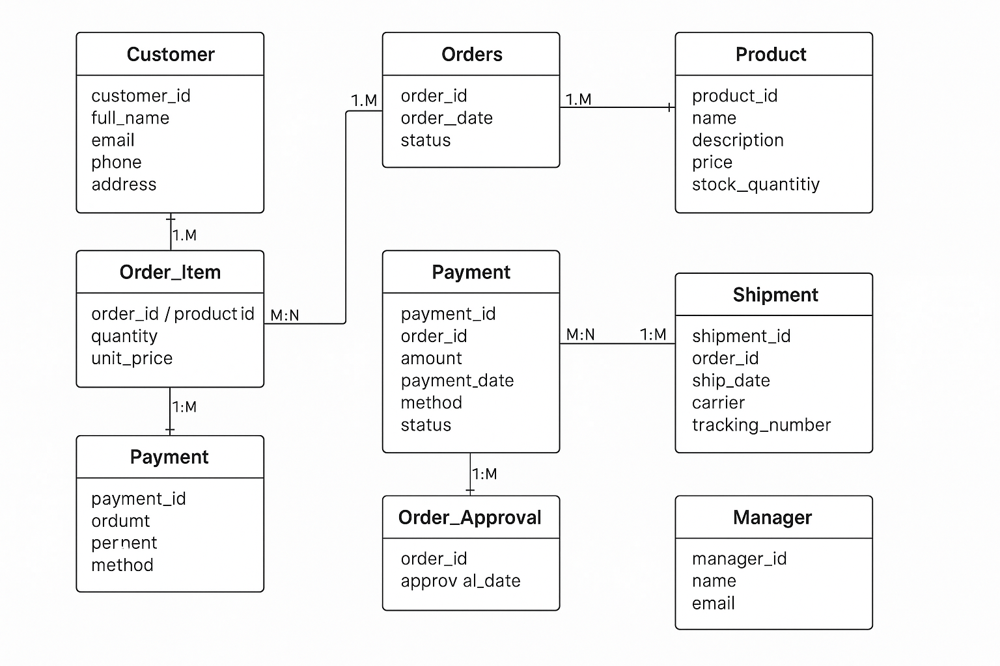  

### Phase IV: Database Management  
- Configured tablespaces and pluggable database environment  
- 
  
- 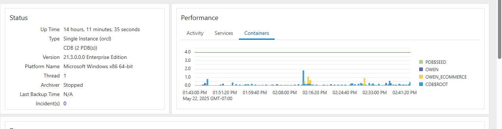  

  

### Phase V: DML and Business Logic  
- Developed tables and inserted data for orders, products, customers, shipments, payments, and approvals  
- 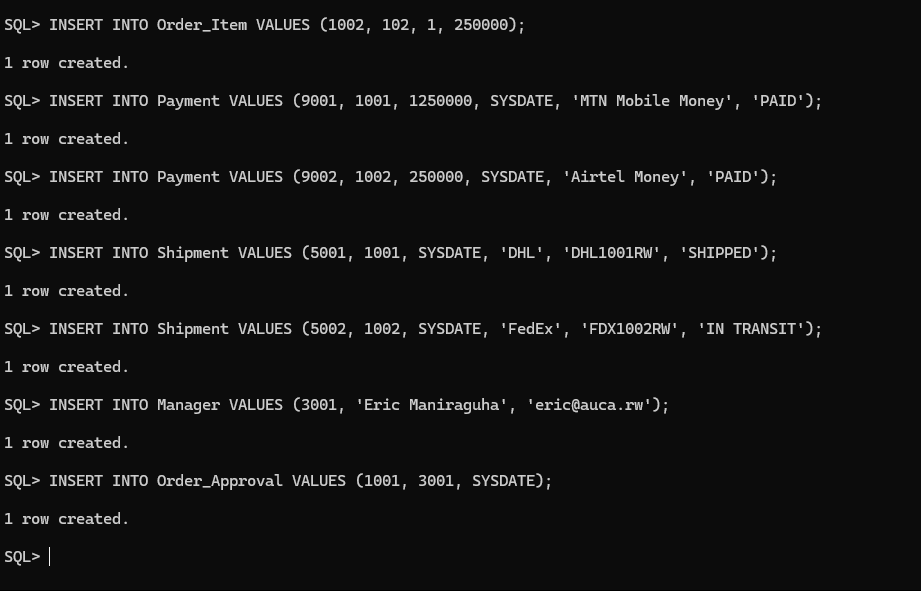  
- 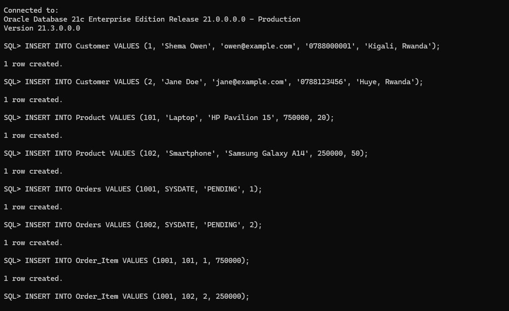  
- 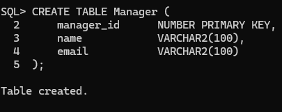  
- 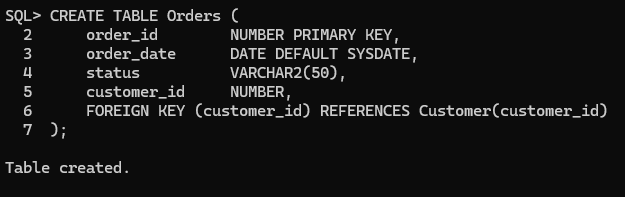  
- 

- 
 
- 
 
- 
  

### Phase VI: PL/SQL Programming  
- Built procedures, functions, and triggers for business automation  
- 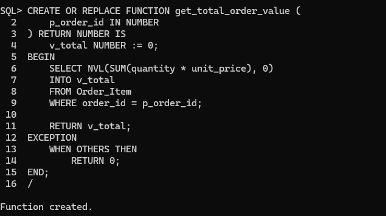  
- 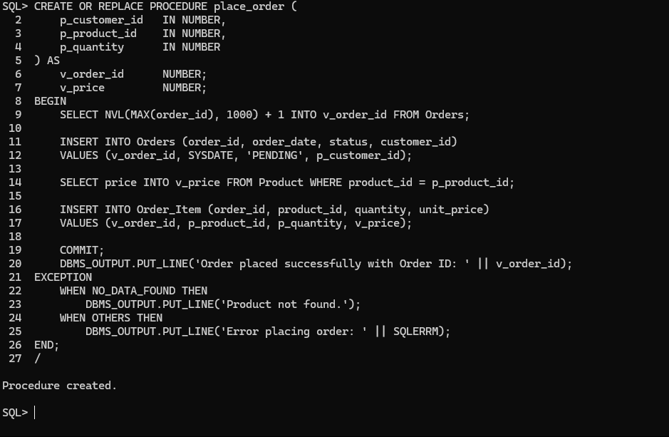  
- 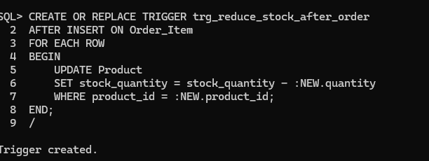  

### Phase VII: Advanced Programming & Auditing  
- Implemented audit mechanisms and security restrictions  
- 
 
- 
 
- 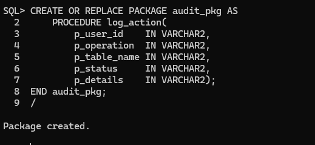  
- 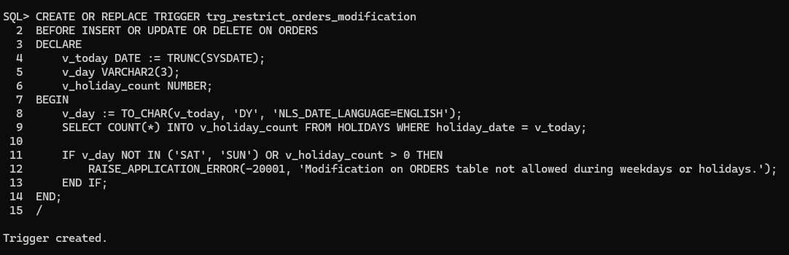  
- 
 
-  

---

## conclusion
The E-Commerce Order Management System successfully automates the order processing workflow and secures data integrity using robust PL/SQL features. Triggers and packages effectively enforce complex business logic, while the comprehensive auditing mechanism provides valuable insights for Management Information System (MIS) functions.

---

   
